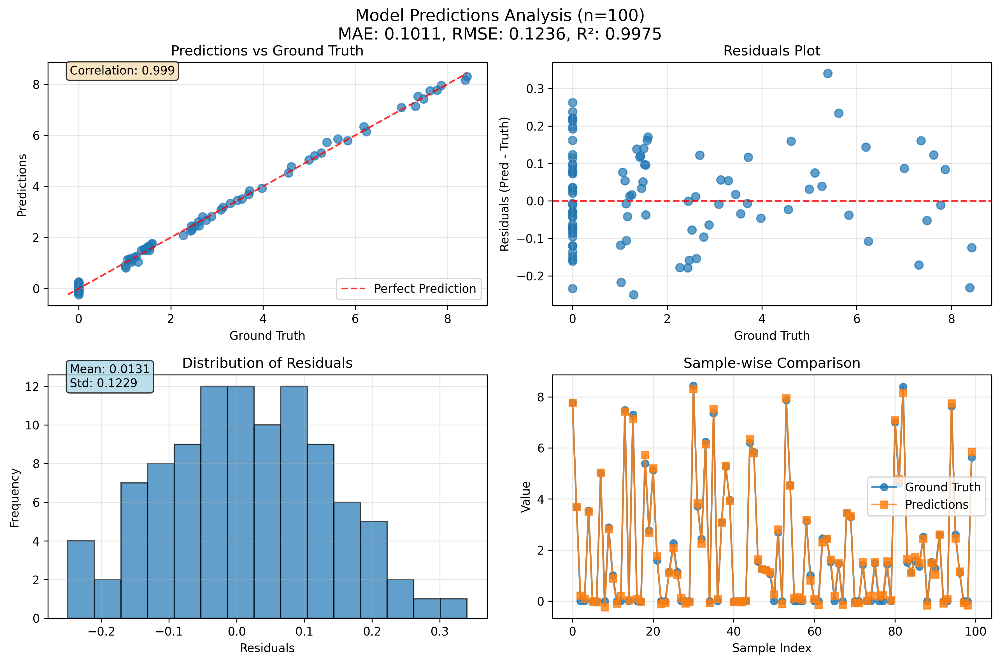

# ultrasonic_image_analysis




A project for automated flaw detection and regression using ultrasonic non-destructive testing (NDT) data. This repository provides workflows for image analysis, raw ultrasonic data processing, and predictive model creation using deep learning.

## WHAT
- End-to-end pipeline for flaw detection and flaw size regression from ultrasonic images
- Data preprocessing, splitting, and augmentation utilities
- Custom PyTorch Dataset and DataLoader for 3D ultrasonic data
- Simple CNN model for flaw size regression
- CLI tools for data download, processing, training, and prediction
- Model evaluation and testing utilities
- Visualization tools for inspection and model evaluation

## INSTRUCTION

1. **Download and extract the data:**
   ```sh
   python -m darkvision.dataset download-and-extract
   ```

2. **Split raw data into train/test sets:**
   ```sh
   python -m darkvision.dataset split-raw-data --test-size 0.2 --val-size 0.1 --max-samples 10000 --num-cpus 8 --seed 42
   ```

3. **Test the DataLoader:**
   ```sh
   python -m darkvision.dataset test-dataloader --folder data/processed/train --batch-size 8
   ```

4. **Train the CNN model:**
   ```sh
   python -m darkvision.modeling.train train --batch-size 16 --epochs 10 --lr 0.001 --device cuda
   ```

5. **Evaluate the trained model:**
   ```sh
   python workflow_scripts/evaluate.py -m './models/cnn_flaw.pt'
   ```

6. **Plot predictions vs ground truth:**
   ```sh
   python -m darkvision.plots plot-predictions --test-dir data/processed/test --model-path models/checkpoint_epoch_100.pt --n-samples 20
   ```

7. **Inspect and animate slices:**
   ```sh
   python -m darkvision.plots inspect --filename <UUID> --slice-idx 4
   python -m darkvision.plots animate --filename <UUID> --output-path reports/figures/animation.gif
   ```

## DATA
Please refer to https://arxiv.org/abs/1903.11399 for details.

**Contents:**
- The directory data contains ultrasonic data sets, containing various flaws. Each batch file is named with a UUID and contains:
  - .bins file: raw data (UInt16, 256 x 256 x 100)
  - .meta file: documents the raw data format
  - .jsons file: json-formatted meta-data for each binary file (flaw locations, source flaw size, equivalent size)
  - .labels file: tab-separated data for flaw existence (0/1) and equivalent flaw size
- The directory src contains python code to train a deep CNN using the data provided. Use ./train.py to run.
- For inference, consult the sample code in src/inference.py.

## Project Organization

```
├── LICENSE            <- Open-source license if one is chosen
├── Makefile           <- Makefile with convenience commands like `make data` or `make train`
├── README.md          <- The top-level README for developers using this project
├── requirements.txt   <- The requirements file for reproducing the analysis environment
├── setup.cfg          <- Configuration file for flake8
├── pyproject.toml     <- Project configuration file with package metadata for darkvision
│
├── .devcontainer/     <- Development container configuration
├── .github/           <- GitHub workflows and CI/CD configuration
│   └── workflows/     <- GitHub Actions workflow files
│
├── data/              <- Data storage directory
│   ├── external/      <- Data from third party sources
│   ├── interim/       <- Intermediate data that has been transformed
│   ├── processed/     <- The final, canonical data sets for modeling
│   │   ├── test/      <- Test dataset
│   │   ├── train/     <- Training dataset
│   │   └── val/       <- Validation dataset
│   └── raw/           <- The original, immutable data dump
│
├── docs/              <- Documentation files (mkdocs project)
│
├── models/            <- Trained and serialized models, model predictions, or model summaries
│   ├── checkpoint_epoch_25.pt
│   ├── checkpoint_epoch_50.pt
│   ├── checkpoint_epoch_75.pt
│   ├── checkpoint_epoch_100.pt
│   └── cnn_flaw.pt    <- Main trained model
│
├── notebooks/         <- Jupyter notebooks for exploratory data analysis
│                         Naming convention: number-initials-description
│
├── references/        <- Data dictionaries, manuals, and explanatory materials
│
├── reports/           <- Generated analysis as HTML, PDF, LaTeX, etc.
│   ├── figures/       <- Generated graphics and figures for reporting
│   └── logs/          <- Training and evaluation logs
│
├── tests/             <- Test files for the project
│   ├── test_data.py   <- Data processing tests
│   └── testing_rayray/ <- Additional testing utilities
│
├── workflow_scripts/  <- Standalone scripts for common workflows
│   └── evaluate.py    <- Model evaluation script
│
└── darkvision/        <- Source code for use in this project
    │
    ├── __init__.py    <- Makes darkvision a Python module
    ├── config.py      <- Store useful variables and configuration
    ├── dataset.py     <- Scripts to download or generate data
    ├── features.py    <- Code to create features for modeling
    ├── plots.py       <- Code to create visualizations
    │
    └── modeling/      <- Model training and prediction code
        ├── __init__.py
        ├── model.py   <- Model architecture definitions
        ├── predict.py <- Code to run model inference with trained models
        └── train.py   <- Code to train models
```

## Model Evaluation

Model evaluation can be performed using the dedicated evaluation script:

```sh
python workflow_scripts/evaluate.py -m './models/cnn_flaw.pt'
```

This script will assess the trained model's performance on the test dataset and generate evaluation metrics and reports.

## Development

The project includes:
- **Development container support** (.devcontainer/) for consistent development environments
- **GitHub Actions workflows** (.github/workflows/) for automated testing and deployment
- **Comprehensive testing suite** (tests/) with data processing and model tests
- **Logging infrastructure** (reports/logs/) for tracking training progress and debugging

## Getting Started

1. Set up the development environment using the provided devcontainer or install requirements manually
2. Follow the instruction steps above to download data, train models, and evaluate results
3. Use the visualization tools to inspect model performance and data quality
4. Refer to the notebooks/ directory for exploratory data analysis examples